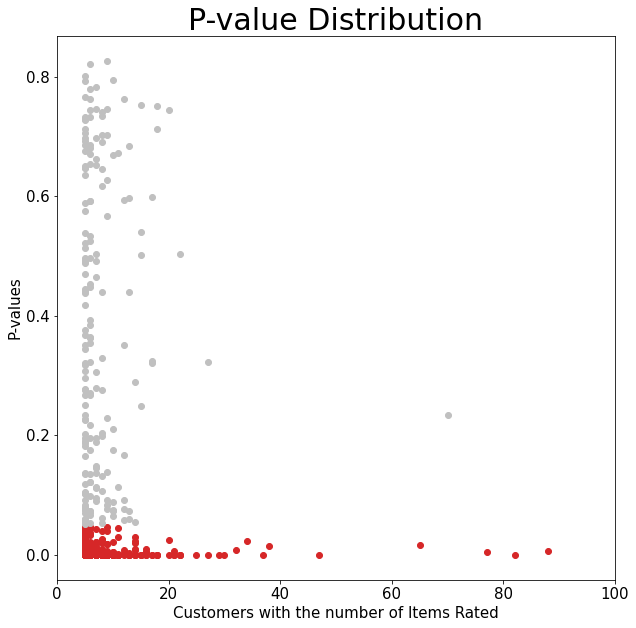

# Amazon Recommender System

**Author**: [Jin-hoon Chung](mailto:ddjh204@gmail.com)

# Overview
Amazon is interested in building a new personalized recommendation system. Visualizations and text summaries are included at the end.

#  Business Problem
It is found that 35% of Amazon's revenue is from the recommendation system ([link](https://www.mckinsey.com/industries/retail/our-insights/how-retailers-can-keep-up-with-consumers)). Amazon offers various recommendations based on popularity, purchase history, browsing history, etc. However, Amazon does not offer a recommendation system built based on customer ratings. While the market size for video gaming is increasing ([link](https://www.ibisworld.com/industry-statistics/market-size/video-games-united-states/)), this analysis will show you how we can build a personalized system for **video games** using customers' ratings.

# Data Understanding
There are two datasets, review data and metadata. They were downloaded from a public [link](https://nijianmo.github.io/amazon/index.html). Both data have information from the year 1996 till 2018.

## Review Data
The review data has customer id, game item id, and ratings. Every rating value is integers from 1 to 5. There is no missing values.

More than half of the ratings are 5.


## Metadata

This data contains information on video games. The selected information is the brand name, category, game item id, and game title. This data will help print out the game titles and organize the information gained from the analysis.

### Cleaning metadata

Brand names will be formatted to simplify the names. Two string values, "\n" and "by", are removed. Any spaces are removed. All letters are lowered.

There are 12,908 duplicate rows, and they are removed.

### Combine Multiple Information
This would be a huge data step. Information from review data will be added to the metadata, and then many columns of categories will be also added to the metadata.

#### Adding Mean of Ratings
Mean of ratings from review data will be calculated and then assigined to each video game in the metadata.

#### Adding Columns for Console Names and Brand Names
Later in the analysis, I will be discussing "similarity". To calculate similarity, we need more specific information. This step will try to gain console information and brand names. Each console name or brand name will be added as a column name. This will tell us if a game item belongs to a console name or a brand name.

Examples of brand names are "Capcom", "Blizzard", and "Sony". Examples of console names are "PC", "Xbox", "Playstation", and "Nintendo".

# Analysis 1 - Building a System
This part will explain how customers would rate the game items they have not rated.

## Train-test-split
The data is split into train data and test data. A model will be trained and validated using train data, and prediction rating will be calculated using test data.

## Baseline Model and Final Model
Analysis will use surprise library to estimate expected ratings. The validation had been checked using RMSE. The whole steps finding the final model is found at **EDA_baseline_model_and_finalized_model_selection.ipynb**. This is a major step building a personalized recommendation system.

### Collaborative Filtering
Collaborative filtering uses a matrix factorization. This will check relationship between each items or between each customers.

RMSE for the baseline model validation:
1.2977

RMSE for the baseline model on test data:
1.2827

RMSE for the final model validation:
1.2852

RMSE for the final model on test data:
**1.2660**

The RMSE for the final model is lowered.

# Analysis 2 - Comparison
This step will make a comparison between predicted ratings and given ratings on 500 randomly selected customers. Each customer will have a unique list of video games, and each video game will be assigned with a mean given rating (popularity) and a predicted rating. T-test will be used to make a comparison of two rating types, and p-values less than 0.05 will prove the difference of two rating types.

# Result 1 - P-values
- Majority of p-values are populated below 0.05.



- More than 60% of customers would have different shopping experience.

The number of customers with significantly low p-values:
311


# Analysis 3 - Hybrid Filtering

The graph below shows one of the extreme cases where one user can have more than 15,000 predicted rating values equal to or close to 5. This would be tough to choose 20 to 30 games to be displayed on the first page of a personalized recommendation list. In this case, we can use [hybrid filtering](https://towardsdatascience.com/recommendation-systems-explained-a42fc60591ed#:~:text=Resources-,What%20is%20a%20Recommendation%20System,give%20to%20a%20specific%20item.). Hybrid filtering can use any combination of recommendation systems, and I have used two systems combined in this analysis. One of the two is collaborative filtering system discussed in the earlier section. The other is to use content-based system (similarity). Using a similarity value that scales from 0 to one, we can find items similar to one of the selected games.


## Similarity
We need to choose one game first.

In real life, we would allow a customer to choose a game the customer actually rated, but the selected game can be anything to show the python code works to check the similarity.

The Chosen game: Resident Evil 7 Biohazard - Xbox One

- 84% of games are excluded after checking similarity. 16 games were selected that has the best match with the selected game.


# Result 2 - Trimmed List of Recommendation
- Many of game names include "resident evil" and all have the same console information.

Game Name | Console
--- | ---
DMC Devil May Cry: Definitive Edition | Xbox One
Resident Evil 6 | Xbox One
Strider | Xbox One Digital Code
Resident Evil 7 Biohazard | Xbox One
Devil May Cry 4: Special Edition | Xbox One Digital Code
Resident Evil Origins Collection | Xbox One Standard Edition
Mega Man Statue &amp; E-Tank with Mega Man Legacy Collection Game | Xbox One Special Edition
Resident Evil 4 |
Resident Evil: Revelations 2 | Xbox One
Resident Evil Origins Collection by Capcom | Xbox One

# Conclusion
- **More than 60% of customers are expected to get a different shopping experience from the personalized recommendation system built based on customers’ ratings on video games. We can expect an increase in sales of less popular games.**
- **A list of many games with calculated ratings equal to or close to 5 can be trimmed using the similarity on one of the rated games.**

## Next Steps
Further analysis could improve the RMSE and trimming method.

- **Control the data size:** A larger data size can improve the RMSE. As the data is up to the year 2018, we can just add more recent data. We can trim the data by removing customers with a low number ratings.
- **Gather more information on video games:** With more information such as genre and release date, we can improve trimming a long list of recommendations.
- If the analysis looks good, we can discuss where and how we can display the recommendations.
- The whole analysis can be repeated with a small update on different departments.

# Repository Structure

```
├── code
│   ├── __init__.py
│   ├── EDA_baseline_model_and_finalized_model_selection.ipynb
│   ├── EDA_basic_cleaning.ipynb
│   ├── data_preparation.py
│   └── visualizations.py
├── images
├── README.md
├── amazon_recommender_system.ipynb
└── amazon_recommender_system.pdf